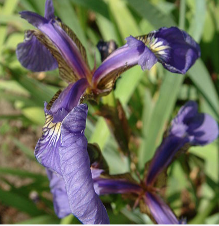
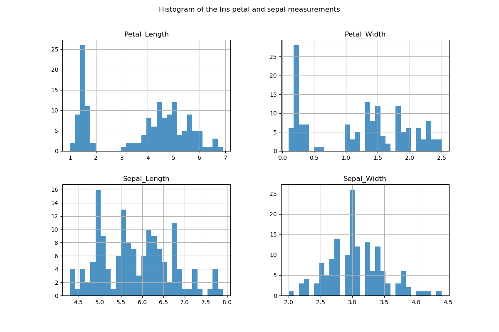
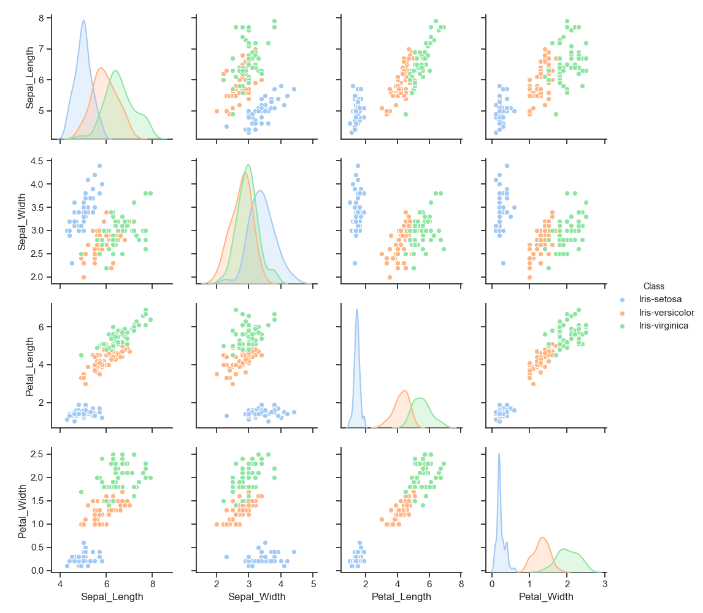

##### pands-project 
Project 2019 for Programming and Scripting Module


# Table of Contents

1. [Introduction to the project](#1.-introduction-to-the-project.) 
2. [The Fisher Iris Data Set](#2.-the-fisher-iris-dataset) 
3. [Python and other software tools used in this project](#3.-python-and-other-software-tools-used-in-this-project)
4. [Download the Iris data set using python code](#3.-download-the-fisher-iris-data-set-and-investigate-it-using-python-code.)
5. [Exploring the data set -summary overview](#exploring)
6. [Exploring the data set in more detail](#detail)
6. [Summarise the data set](#summarise)
7. [conclusions](#conclusions)
10. [References](#references)

<a name="1.-introduction-to-the-project."></a>
# 1. Introduction to the project.

This repository contains my submission for the [Programming and Scripting Project 2019](https://github.com/ianmcloughlin/project-pands/raw/master/project.pdf) class project for the Programming and Scripting Module at GMIT as part of the Higher Diploma in Computing and Data Analytics.

The project concerns the well-known Fisher's Iris data set. 
It entails researching the data set, and then writing documentation and code in the Python programming language based on that research.

The repository consists of this readme file and some python scripts containing the code used to investigate the iris data set. 
The readme file introduces the project and outlines the requirements of the project. It also contains some background information about the Fisher's Iris data set including some information about where it originated, who created it, and how it was put together.   
The readme outlines the tools used in preparing and executing this project and some information on how to run the python code including how the data can be loaded into python, what the python code does and what output is produced by running it.

The aim of the project is to investigate the Iris dataset using the Python programming language. Python can be used to gain a high level overview of a dataset such as the Iris dataset.  Statistics and visualisations can be very easily generated using a programming language such as Python. Plots produced in Python can provide an overview of of a dataset.   
The python programming language is widely used in statistical and machine learning. The Iris data set is frequently referenced in online tutorials and text books relating to machine learning. 

My main objective in this project is to learn more about the python programming by applying it to the Iris data set in this project. There are many free resources available, starting with the extensive [python documentation](https://docs.python.org/3/) for its standard library of modules. There are also several well known third-party packages that enhance the use of python and are used for data analytics and machine learning.  

A web search on the Iris data set will return many pages of results. Many of these apply machine learning to the Iris data set. I will look at the reasons why the Fisher Iris dataset is considered such an important database in the field of statistical and machine learning - particularly in the area of classification. 

The iris dataset is described as having one class that is linearly separable from the other two classes so I will look at this in the code, particularly using the plots.

### Problem Statement <a name="problem-statement"></a>

As outlined in the [Programming and Scripting Project 2019](https://github.com/ianmcloughlin/project-pands/raw/master/project.pdf) instructions, the project should achieve the following goals:

1. Research background information about the data set and summarise it.    
2. Provide a list of references used in completing the project.  
3. Download the data set using Python code.
4. Investigate the data set using python code  
5. Summarise the data set using python. Provide summary statistics.  
5. Summarise the investigations.
6. Include supporting tables and graphics.

<a name="2.-the-fisher-iris-dataset></a>
# 2. The Fisher Iris dataset.


>This is perhaps the best known database to be found in the pattern recognition literature. Fisher's paper is a classic in the field and is referenced frequently to this day. 

The [Iris Data Set](https://archive.ics.uci.edu/ml/datasets/iris) is available from [The UCI Machine Learning Repository](http://archive.ics.uci.edu/ml/about.html) which has a wide collection of databases used by the machine learning community for the empirical analysis of machine learning algorithms.  

According to UCI Machine Learning Repository, the Iris dataset is widely used in pattern recognition learning. One class is linearly separable from the other two classes, which are not linearly separable from each other. The predicted attribute of the data set is the class of Iris plant to which each observation belongs.     

The Iris dataset is a multivariate dataset with a default machine learning task of classification. It consists of 150 instances with five attributes, with four of these being the measurements of the sepal and petals of each observation in the data set and the fifth being the class or species of Iris that each observation belongs to.
It includes 50 plants each of three classes of Iris plant, where each class is a different type or species of Iris plant.
The three classes in the data set are  the Iris Setosa, the  Iris Versicolor and the Iris Virginica. 
The data set was donated in 1988 by Michael Marshall but the data set was created by R.A. Fisher in 1936.     

http://archive.ics.uci.edu/ml/datasets/Iris.


 Images of Iris Setosa (left),   Iris Versicolor (centre) and Iris Virginica (right)
<p float="left">
  
  
   
</p>
The following attribute information is provided along with the data set on the UCI Archive page.   

**Attribute Information:**
   1. sepal length in cm
   2. sepal width in cm
   3. petal length in cm
   4. petal width in cm
   5. class: 
      - Iris Setosa  
      - Iris Versicolor  
      - Iris Virginica  

The Iris data set is so well known that it has its own wikipedia page! Much of the information about the Iris dataset in this section is primarily gathered from following the web links at the [Iris flower data set wikipedia wiki](https://en.wikipedia.org/wiki/Iris_flower_data_set#cite_note-5) and the [UCI Machine Learning Repository - Iris Data Set](https://archive.ics.uci.edu/ml/datasets/iris) pages which both provide references to the works by R.A. Fisher and Edgar Anderson. 

>Sir Ronald Aylmer Fisher (17 February 1890 – 29 July 1962) was a British statistician and geneticist. For his work in statistics, he has been described as "a genius who almost single-handedly created the foundations for modern statistical science" and "the single most important figure in 20th century statistics".

In 1936 Fisher introduced the Iris flower data set as an example of discriminant analysis which he proposed as a method to predict qualitative values. He used it to distinguish the different species of Iris flowers from each other using the combination of the four measurement variables in the data set.

According to [The Use of Multiple Measurements in Taxonomic Problems](https://onlinelibrary.wiley.com/doi/pdf/10.1111/j.1469-1809.1936.tb02137.x) by R.A Fisher
>When two or more populations have been measured in several characters, xl, ...,x8, special interest attaches to certain linear functions of the measurements by which the populations are best discriminated.

Fisher considered the question of what linear function of the four measurements would maximise the ratio of the difference between the specific means to the standard deviation between species.  Based on the combination of the four measurement features of the sample of plants in the iris datas set, he developed a linear discriminant model to discriminate or distinguish the Iris species from each other. 

*Discriminant analysis* is a statistical classification method used when the dependent variable is categorical. Discriminant analysis looks for the best linear combination of independent variables that will discriminate between the categories of the dependent variables and to see if significant differences exists among the groups of predictor variables. 
It is a popular technique in statistics when there are more than two responses classes and is considered more stable than logistic regression (another popular statistical method for classifying qualitative or categorical variables) when the predictor classes are well separated. 
The distribution of the predictor variables are modelled separately in each of the response classes or dependent variables.

According to the [Iris Flower Data Set](https://en.wikipedia.org/wiki/Iris_flower_data_set) Wikipedia page:
>Based on Fisher's linear discriminant model, this data set became a typical test case for many statistical classification techniques in machine learning such as support vector machines. 

Fisher also developed the *ANOVA* method (Analysis of Variance) which he used to analyse data from crop experiments. He pioneered the principles of the design of experiments and the statistics of small samples and the analysis of real data.

While Fisher used the Iris data set as an example to demonstrate statistical methods of classification, the Iris data itself was actually collected by Edgar Anderson, an American botanist and geneticist. Fishers's Iris data set is therefore often known as *Anderson's Iris data set*.   

[Edgar Anderson](https://en.wikipedia.org/wiki/Edgar_Anderson) was particularly interested in the variation in plant species or a group of species, and in evolution in general. [Anderson](http://people.wku.edu/charles.smith/chronob/ANDE1897.htm) is known for his work in the genetics of hybridization and character variation measurement.

Andersons's interest in the iris plants was for [morphological](https://en.wikipedia.org/wiki/Morphology_(biology)) reasons and he was trying to find out how one species of Iris could have evolved from another species.

http://people.wku.edu/charles.smith/chronob/ANDE1897.htm

According to a [biolographical memoir](http://www.nasonline.org/publications/biographical-memoirs/memoir-pdfs/anderson-edgar.pdf) on Edgar Anderson, written by a fellow botanist [G. Ledyard Stebbins](https://en.wikipedia.org/wiki/G._Ledyard_Stebbins), Anderson carried out research in the 1920's that focused on developing techniques to quantify geographic variation in Iris versicolor. 
In this memoir, Leyard describes how Anderson had observed that there was a lot of genetic variation within most populations of plants and set out to find a few easily recognisable, well-differentiated species to research. Anderson chose the Iris Versicolor as he had previously believed it to be a clearly defined species. However he subsequently discovered that it was actually two species which he could tell apart after some preliminary analysis. Anderson then set out to find how one species could have evolved from another and collected a very large samples of iris flowers to analyse. This led had to seek a third species that could be a possible alternate parent for one of the two species that he was studying. The course of his research led him to the Iris Setosa, a species native to Alaska. His research indicated that the Iris Versicolor of northeastern North America had arisen as an [amphiploid](https://en.wikipedia.org/wiki/Polyploidy#Terminology), one parent being Iris Virginica of the Mississippi Valley and the Southeast Coast and the other being the Iris Setosa of the Yukon Valley Alaska. 

Anderson carefully examined the individual characters of the iris plants that were growing in different conditions. He used scatter diagrams and ideographs  - simplified diagrams which he developed himself - so that he could visualise and compare the data more easily. 
These methods helped him to come to conclusions about the data.
  
Anderson did further study on the genus Iris in the 1930's looking at the complex variation patterns of populations found in the Mississippi  delta region.
From further study he showed that while the variation with respect to leaves, stems and other vegetative characteristics of the plant was due largely to [phenotypic](https://en.wikipedia.org/wiki/Phenotype) modification, the reproductive characteristics (the flower including petals and sepals) were remarkably constant for a genotype and exhibited a large amount of genotypic variation within populations.
[Biographical Memoir of Edgar Anderson by G Ledyard Stebbins](nasonline.org)

In the 1936 Iris data set, the two species Iris Setosa and Iris Versicolor were found growing together in the same colony in the Gaspé Pensinsula in Canada. The sample of the third species - the Iris Virginica differs from the other two samples as they were not taken from the same natural colony. 
Fisher used a linear compound of the four measurements and then looked at the means and variations of the compound measurements.
He showed that the differences between the Iris Setosa and the Iris versicolor was so great compared to the standard deviations of the compound measurements while the differences between the  Iris Virginica and the Iris Versicolor was less than four times the standard deviation of each species.  
Fisher concluded that there as there is some overlap between the distributions of the Iris Virginica and the Iris Versicolor and therefore they are not as easily distinguished from one another based solely on the four measurements.


>It will be  noticed, as was anticipated  above, that there is some overlap of the distributions of I. Virginica and I. versicolor, so that a certain  diagnosis of these two species could not be based solely on these four measurements of a  single flower taken on a  plant growing  wild. It is not, however, impossible that in culture the measurements alone should afford a more complete discrimination.


---
### The Iris data set and machine learning
The Iris dataset appears in many text books and tutorials related to statistical and machine learning. Statistical learning is a set of tools for modelling and understanding complex data sets. Machine learning is about learning from data and while it is often associated with artificial intelligence, it is also used in  areas such as image and voice recognition, natural language processing and many other areas.  Machine learning is about learning some properties of a data set and then testing those properties against another data set.

[scikit-learn](https://scikit-learn.org/stable/index.html) is a machine learning package in python that actually uses the Iris dataset in its demonstrations. Scikit- learn provides some information about machine learning and outlines how in general a [machine learning problem](https://scikit-learn.org/stable/tutorial/basic/tutorial.html#machine-learning-the-problem-setting) 
>considers a set of n samples of data and then tries to predict properties of unknown data. If each sample is more than a single number and, for instance, a multi-dimensional entry (aka multivariate data), it is said to have several attributes or features.
  
The Iris data set is a relatively small multi-variate data set containing of only 150 rows and 5 fields or variables in columns. Each observation in the Iris data set consists of a four dimensional array of numerical measurements and a single categorical class of iris species to which it belongs and represents one instance of an iris plant or flower.
 
Machine learning uses some algorithm or other to solve the classification or prediction problem. An algorithm takes inputs and produces some outputs. The machine learning task that is generally applied to the Iris data set is *classification*. A classification algorithm applied to the Iris data set might take in the features of some observations and output the class to which the observation is more likely to belong to. The objective of classification would be to classify or predict the class label of a new instance of an Iris flower (from outside the data set) to the class or species to which it belongs. Each of the rows in the Iris dataset is an observation or a data point while each column holds a variable or feature. The Iris dataset contains more than two possible classes and therefore is considered a multi-class classification problem.

Each observation in the  Iris data set represents one instance of an iris plant or flower. Each observation belongs to one class of three possible classes and these labels are provided in the data set. This is an example of *supervised learning* where the data comes with additional attributes that we want to predict. Supervised learning can be either a *classification* problem where the 
samples belong to two or more classes and we learn from already labeled data how to predict the class of the unlabeled data or a *regression* problem where the desired output consists of one or more continuous variables.  
There are many tools or algorithms in supervised learning that can be used to predict an outcome from a data set such as logistic regression, linear discriminant analysis, classification trees, support vector machines and many more.    
Some classification algorithms are based on nearest neighbour, where an observation might be assigned to a class based on its proximity to another observation.
  
In *Unsupervised learning*, the training data consists of a set of inputs without any corresponding target values or labels. One of the goals of unsupervised learning is to discover groups or *clusters* of similar examples within the data. It is also used to determine the distribution of data within the input space, known as density estimation, or to project the data from a high-dimensional space down to two or three dimensions for the purpose of visualization.


Unsupervised learning tends to be more subjective as there is no simple goal for the analysis, such as prediction of a response. Unsupervised learning is often performed as part of an exploratory data analysis. 
While it is possible to check results from supervised learning and to see how well a model predicts the response variable on observations not included in fitting the model, this is not the case in unsupervised learning and it is not so clear how to assess the results obtained compared to supervised learning.
   

At a quick first glance, the Iris flowers would seem quite similar and hard to tell apart. However a closer look at the overall plant's description including features such as plant height and leaf type as well as colour, would make them seem a bit easier to distinguish from each other which makes me wonder why only the petal and sepal measurements of the flower are used and not other features of the plants.

However, as experts in their fields, Fisher and Anderson looked specifically at the petal and sepal measurements, or more specifically a compound measurement of these variables as a way to classify the Iris plants which shows how important it is in machine learning to have some background knowledge of the data from an expert in a field, such as the biologists and botanists Fisher and Anderson in the case of the Iris data set.


The Fisher Iris data set is still widely used in learning classification methods.

<a name="3.-python-and-other-software-tools-used-in-this-project."></a>
# 3. Python and other software tools used in this project

The purpose of this project is to investigate the Fisher Iris data set described above using python code.
Python is a high level interpreted general purpose programming language. The python interpreter and its extensive standard library are freely available to all. Along with the python standard library, there are many libraries that enhance the usage of python and make it a powerful tool for performing data analytics and machine learning.  


### How to download this repository.
1. Go to the URL for the repository on GitHub at [https://github.com/angela1C/pands-project.git](https://github.com/angela1C/pands-project.git).
2. Click the green `Clone or download` button
   
### Python 3
To be able to run this script, you need to have Python 3 installed. You can check this on the command line using `python -V`.
If you do not have Python 3 installed go to https://www.python.org/downloads/ and follow the instructions there.

Python comes with a library of standard modules that can perform a wide range of tasks. These modules can be imported using the `import` function. In addition to the standard modules, there are many third-party packages which enhance it's functionality and I use some of these packages in this project outlined below, in  particular the [pandas](https://pandas.pydata.org/about.html) package which provides data structures and data analysis tools for the Python programming langauge. These packages can be also be imported but they first need to be installed on your system. See [Installing Packages](https://packaging.python.org/tutorials/installing-packages/#requirements-for-installing-packages) of the [Python Documentation](https://docs.python.org/3/index.html).
`pip` is the package installer for Python and can be used to install packages from the [PyPI](https://pypi.org) repository of software for the Python programming language.

[pandas installation instructions](https://pandas.pydata.org/pandas-docs/stable/install.html) recommend installing the package as part of the Anaconda distribution, a cross platform distribution for data analysis and scientific computing using `conda install pandas`.
The `seaborn` package can be installed using `pip install seaborn` or `conda install seaborn`. [seaborn installation instructions](https://seaborn.pydata.org/installing.html)
 
The `pandas` library is the main python library being used in this project. According to the [pandas package overview ](https://pandas.pydata.org/pandas-docs/stable/getting_started/overview.html)  

> `pandas` is a `Python` package providing fast, flexible, and expressive data structures designed to make working with “relational” or “labeled” data both easy and intuitive. It aims to be the fundamental high-level building block for doing practical, real world data analysis in Python.  

[pandas](https://pandas.pydata.org/index.html) provides high-performance, easy-to-use data structures and data analysis tools for the Python programming language. It is designed for working with data that is in a tabular format containing an ordered collection of columns where each column can have a different value type.  This makes it ideal for exploring a structured tabular dataset such as Iris which contains several numerical columns and one categorical column. 

The [seaborn](https://seaborn.pydata.org/index.html)
> is a Python data visualization library based on matplotlib. It provides a high-level interface for drawing attractive and informative statistical graphics. 

The [seaborn](https://seaborn.pydata.org/introduction.html#introduction) library is used for making statistical graphics in Python. It is built on top of `matplotlib` and closely integrated with `pandas` data structures. It provides a high-level interface for creating nice looking and informative plots. It has many useful features for examining relationships between multiple variables such as those in the Iris dataset. 

[matplotlib.org](https://matplotlib.org)
>Matplotlib is a Python 2D plotting library which produces publication quality figures in a variety of hardcopy formats and interactive environments across platforms

### How to run the python code
To run the python script, first navigate to the folder downloaded from this repository.

At the command line enter python <program_name> for example: $ python project_iris.py

The python program can also be run inside the environment of an iPython session using the `%run` command.
 `% run project_iris.py`  
 I used `ipython` to run interactive code. This was very useful in testing sections of the script, rather than running the entire python script for each change.

 There are several plots produced by the script. I have saved these to .png files in the images folder of the repository. The plots can be printed by uncommenting the 'plt.show()` command. Some of these plots are shown in this Readme file below. 

 The output of the python script (excluding plot images) can be saved to a text file by appending `>'filename.txt'`.
 I have saved the output in this repository in a file called 'iris_output.txt' for convenience.
 

### Loading python libraries

The libraries mentioned above must first be imported before they can be used by the script.  

The pandas library is imported at the very start of the script using `import pandas as pd` where `pd` is a shorter alias name that is used by convention to save having to write `pandas` each time it is used.
 Therefore, wherever `pd` is used in the script, it is referring to the pandas library. Similarly, the `seaborn` library is imported using the alias `sn` and thereafter referred to using `sn`. Once these packages are loaded, all of the available functions can be used by the script.

```python
import pandas as pd  
import matplotlib.pyplot as plt 
import seaborn as sns
```

### Getting help in python
To get help on any python command, use the python help function as outlined in the [Python help command document](https://docs.python.org/3/library/pdb.html?highlight=help#pdbcommand-help) with the command in parentheses.  
For example, `help(pd)` will show help on the python `pandas` package while `help(pd.DataFrame.describe())` provides help on the `describe` function of the pandas DataFrame.    
The documentation pages for each of the python packages that are used in this project provided details of all the commands for that package. I found these resources quite valuable for this project and referred to them extensively over the course of this project, both when looking for a function to do something in particular but also for getting a start with the packages as the documentation pages are quite comprehensive and outline the different functions of the various packages.

 
-[Pandas.pydata documentation](https://pandas.pydata.org/pandas-docs/stable/getting_started/index.html)  
-[Matplotlib documentation](https://matplotlib.org/index.html)  
-[Seaborn.pydata documentation](https://seaborn.pydata.org/index.html)  
-[Python 3 documentation](https://docs.python.org/3/index.html)  


### GitHub and Git are used to manage the project.

# 3. Download the Fisher Iris Data set and investigate it using Python code.

The Iris Data Set is available from the UC Irvine Machine Learning Repository at http://archive.ics.uci.edu/ml/datasets/Iris in csv format as described above in section 2. 
I am using the python `pandas` library to import the csv file. 

Using `pandas`, tabular data can be imported as a `DataFrame` object. A pandas `DataFrame` represents a rectangular table of data containing an ordered collection of columns and each column can have a different value type. The Iris data set contains four numerical columns for the petal and sepal measurements and one categorical column for the class or type of iris. 

The pandas `read_csv`function loads delimited data from a file, URL or file-like object using the comma as the default delimiter and  creates a `DataFrame` object. When a pandas `DataFrame`  object is created, it has many attributes and methods available that can be used on that object.

The Iris data set can be read in directly from the url at 
[https://archive.ics.uci.edu/ml/machine-learning-databases/iris/iris.data](https://archive.ics.uci.edu/ml/machine-learning-databases/iris/iris.data) or alternatively it can be saved locally and read in by specifiying the file path.   
In the script, I will download the csv file into python as part of the script. (The csv file containing the Iris data set is also saved into this project's repository for convenience.) 

The raw csv file at the UCI Machine Learning repository does not have the attribute information included in the csv file itself. However this information can be found under the section [Iris Data Set: Attribute Information](https://archive.ics.uci.edu/ml/machine-learning-databases/iris/iris.names) which provides the attribute information consisting of the 4 measurement attributes (sepal length in cm, sepal width in cm, petal length in cm, petal width in cm) and the three classes (Iris Setosa, Iris Versicolor and Iris Virginica).     
  
As outlined in the documentation at [pandas-csv-text-files](https://pandas.pydata.org/pandas-docs/stable/user_guide/io.html#csv-text-files), `read_csv` has various options for specifying what column names to use. Often the first row of a csv file would contain the column names. If column names are not passed to `read_csv`, by default it looks to the first row of the data and infers the row names from this row. If the column names are in another row you can specifiy this as an optional argument. In the python script, I create a list containing the names to be used and then pass this as an argument `names` to `read_csv`.

The data types for each column will be inferred by the `read_csv` function if they are not explicitly provided to `read_csv`. 
`index` (row labels) and `columns` (column labels) could also be provided as optional arguments to `read_csv`, otherwise they will be constructed from the input data.  

There are other  optional parameters which can be set for the `read_csv` function and these can be found using `?pd.read_csv` or as mentioned above on the documentation pages at [pandas-csv-text-files](https://pandas.pydata.org/pandas-docs/stable/user_guide/io.html#csv-text-files).
My python code for reading in the Iris data set does the following:

1. Create `csv_url` and pass to it the url where the data set is available 'https://archive.ics.uci.edu/ml/machine-learning-databases/iris/iris.data'. 
2. Create a list of column names `col_names` using the iris attribute information. 
3. Create a panda's DataFrame object called `iris`.


```python
      csv_url = 'https://archive.ics.uci.edu/ml/machine-learning-databases/iris/iris.data'
      # using the attribute information as the column names
      col_names = ['Sepal_Length','Sepal_Width','Petal_Length','Petal_Width','Class']
      iris =  pd.read_csv(csv_url, names = col_names)
```

Having loaded the iris data set, the resulting `iris` DataFrame can be viewed using the DataFrame methods `head()` and `tail()` to see the first 5 rows and the last 5 rows respectively. The data types can be checked to ensure they were correctly inferred using `dtypes`.
Use the `print` function with these to print the results to the screen.

```python
print(iris.head())
print(iris.tail())
print(iris.dtypes)
```


# 4. Investigating the Iris dataset in Python.

#### http://pandas.pydata.org/pandas-docs/stable/getting_started/dsintro.html#dsintro 

The first part of my analysis looks at an overview of the Fisher Iris data set including some summary statistics that describe the data at a high level and some basic plots that provide an overall picture of the Fisher Iris data set. 

The `pandas` library has many functions that can be used to explore the Iris data set. Having imported the iris data set from a csv file into a pandas `DataFrame`, all the attributes and methods of `DataFrame` objects can be used on the iris DataFrame object.

`pandas` objects have a number of attributes to access the metadata. [Attributes and Underlying Data](http://pandas.pydata.org/pandas-docs/stable/getting_started/basics.html#attributes-and-underlying-data)

As Python is an object oriented language, everything in it is an object where an object is an entity that contains data along with associated meta data and/or functionality. These attributes and methods are accessed via the dot syntax. (see page 16 - A whirlwind guide to Python)

- See the list of DataFrame attributes and methods here: [DataFrame attributes](http://pandas.pydata.org/pandas-docs/stable/reference/api/pandas.DataFrame.html#pandas.DataFrame)

I look firstly at the meta-data of the Iris DataFrame using the attributes of the Iris DataFrame object.

- The `ndim` attribute shows the number of axes / array dimensions of the Iris data set.
- The `shape` attributes gives the axis dimensions of the object - the number or rows and columns in the table of data.
This will show how many rows (containing observations) and columns (containing features/variables) in the Iris Data set.
- The `index` attribute shows the index which was automatically assigned when the dataFrame was created on reading in the csv file.
- The `size` attribute shows the number of elements in the DataFrame.
- The `columns` attribute shows the column labels of the DataFrame. 
- The `axes` attribute returns a a list representing the axes of the DataFrame and will show the row axis labels first and then the column axis labels. This essentially shows same information as the `index` and `columns` attributes.
- The `dtypes` attribute shows the data types of the DataFrame. These were inferred by `read_csv`.

The following is the python code used in the script. I have included print statements in the script to make it easier to read the output when all commands are ran together in the script.

```python
print("The column labels of the iris DataFrame are: ", *iris.columns, sep = "   ")
print("The column labels of the iris DataFrame are: ", *iris.columns, sep = "   ")
print(f" The index of the dataframe is: ", iris.index)
print("The index for the rows are ",*iris.index)
print("This index was automatically assigned when the DataFrame was created above")
print(f"The iris DataFrame has {iris.ndim} dimensions")
print(f"The iris data set has {iris.shape[0]} rows and {iris.shape[1]} columns")
print(f"The iris DataFrame has {iris.size} elements in total")
print(f"The data types of iris dataframe are as follows:")
print(iris.dtypes)
print(iris.axes)
print("The row axis labels of the iris DataFrame are  ", *iris.axes[0])
print("The column axis labels of the iris DataFrame are as follows:\n ",*iris.axes[1])
```

#### Attributes of the Iris DataFrame 

- The iris DataFrame has 2 dimensions. 
- The Iris DataFrame set consists of 150 rows and 5 columns corresponding to the rows and columns of the iris csv file.  
- There are 750  elements in total.  
- The column labels of the iris DataFrame are as specified when reading in the csv file: 
   Sepal_Length   Sepal_Width   Petal_Length   Petal_Width   Class
- The index of the DataFrame is:  RangeIndex(start=0, stop=150, step=1). This index was automatically assigned when the DataFrame was created above.

 - The row axis labels of the iris DataFrame is a range from  0 1 2 ... 147 148 149 

- The column axis labels of the iris DataFrame correspond to the column names as follows:
  Sepal_Length, Sepal_Width, Petal_Length, Petal_Width, Class


---
#### Investigating the Iris dataset using some DataFrame methods 

The `head` and `tail` methods are very useful to take a quick look at the observations at the top and bottom rows of the dataframe. The number of rows to display can be specified as an argument. 

```python
print(iris.head(10))
print(iris.tail(10))
```
###### The top of the iris data set:


###### The bottom of the iris data set:


  
The rows at the top belong to the Iris Setosa class. The rows at the bottom belong to the Iris Virginica class. This is just the way the observations are ordered in the csv data set from which the dataframe is created.

The data can be checked for any missing values using the `isnull()` method while `notnull()` returns the opposite.
`isnull()` returns a `True` or `False` boolean value for each observation. Boolean values are coerced to a 1 for True and 0 for False so the `sum` function can be used to count the number of `True` values in the data set, rather than printing all the `True` and `False` values.
The Fisher Iris data set is a small complete data set with no missing values.  

`pandas` objects have a set of common mathematical and statistical methods. Most of these methods produce a single value such as the mean or the max or standard deviation.  Multiple summary statistics can be obtained in one go using the `describe()` method.
By default, the descriptive statistics on `pandas` objects excludes missing value. 

Note that the summary statistics below are for the data set as a whole. Later I look at the descriptive statistics by class or species of iris plant.
 
The pandas `describe` function shows the following:

- The `count` or number of the non-NA/null observations in the dataset.  
- The `max` shows the maximum of the values and the `min` shows the minimum of the values. 
- The `mean` shows the mean or average of the values (the sum of data values divided by total number of values), the `std` shows the standard deviation (a measure of the dispersion or spread of the data) of the observations. 
- The `describe` function also shows the 25th, 50th and 75th percentiles. The 25th percentile shows the percentage of values falling below that percentile. The 50th percentile shows the same information as the median would, that is where 50% of the values fall above and 50% fall below the value.
- The various statistics that are generated from the `describe` function can also be obtained on their own. For example the mean could be obtained using `iris.mean()`, minimum with `.min()` etc.

```python
print("The number of null or missing values in the iris dataframe for each column: ")
print(iris.isnull().sum())
print(f"A concise summary of the iris DataFrame: \n")
iris.info()
print(f"\n The number of non-NA cells for each column or row are: \n {iris.count()}")
# Using the `unique()` method on the 'Class' column to show how many different class or species of Iris flower is in the data set.
species_type =iris['Class'].unique()
print("The following are the three class or species types of iris in the data set \n",*species_type, sep = " ")
# count the number of distinct observations for each column 
iris.nunique()
print("Here are some summary statistics for the iris DataFrame: \n ")
print(iris.describe())
```

The code output shows that there are no null values, the RangeIndex has 150 entries from 0 to 149. The four measurement columns each consist of 150 non-null float64 numbers.

  
The three classes or species types of iris in the data set are Iris-setosa, Iris-versicolor and Iris-virginica

Here are some summary statistics for the iris DataFrame: 
  


- The initial exploration of the Iris DataFrame shows that there are 150 rows and 5 columns of data. 
Each row corresponds to an individual observation of an iris plant. 
- The columns show the individual measurements (in centimetres) of the length of the sepal, the length of the petal, the width of the sepal and the width of the petal.

- The mean of the Sepal length is greater than the mean of the other three measurements.   
- The measurements of the petal width has the lowest average measurements.   
- The standard deviation in the petal lengths shows the highest variability of the four measurements at 1.76 while the standard deviations of the petal width is approx 0.43.  
- The shortest petal in the data set is 1 cm while the longest petal is 6.9 cm.  
- The widths of the petals vary from 0.1 cm to 2.5 cm.  
- The shortest sepal in the data set is 4.3 cm while the longest sepal is 7.9 cm. 
- The narrowest sepal is 2cm while the widest sepal is 4.4 centimetres.  
- There are 50 observations in each class.
---
## Visualising the Iris data set
A picture tells a thousand words. Visualising the data was key to Edgar Anderson's reaching his conclusions, although he did not have the convenience of a programming language such as python to do so!. 
Fisher also visualised the iris dataset using histograms.  

I will now look at some visual summaries of the Iris data set using some plots and see what it shows. Using python to do so is som much easier than the work that Anderson did by hand. 
  
Plots can show how variables in the Iris data set relate to each other and trends and patterns that may indicate relationships between the variables.  
In particular I am looking to see at how *linearly separable* the three different classes of Iris appear as this seems to be a key reason for the Iris data set being so widely used the machine learning.  

The [matplotlib - pyplot](https://matplotlib.org/tutorials/introductory/pyplot.html#sphx-glr-tutorials-introductory-pyplot-py) package can be used to create a graph or plot of the Iris Data set. The [pandas](https://pandas.pydata.org/pandas-docs/stable/user_guide/visualization.html#visualization) library also has some built in methods to create visualisations from DataFrame and Series objects which are based on the `matplotlib` library.
     
A `histogram` is a representation of the distribution of data. It charts the data using adjacent rectangular bars and displays either the frequency or relative frequency of the measurements on the interval or ratio scale.
The pandas `hist` function calls `matplotlib.pyplot.hist` on each numerical series in the DataFrame, resulting in one histogram per column.

The histograms here show the distribution of each of the the measurements attributes across the iris data set. 



The histogram for the petal lengths show a clear group of observations having petal lengths that are much smaller than the rest of the observations and similarly so with the petal widths. The sepal lengths show quite a bit of variation with a number of peaks while sepal widths seem to be centred around 3 cms but with a few smaller peaks at both sides of 3 cms.  

A `boxplot` is a very useful plot as it shows various statistics in one go, including the median, quantiles, interquartile range, outliers etc. The length of the box is the interquartile range and measures the variability in the data set. The interquartile range (IQR) is the middle 50% of the data and can show the spread or variation of the data. The whiskers show if the data is skewed in one direction or the other. The median is the line through the box.   

Along with showing the distribution of values within each category, boxplots also allow for comparisons across the various classes. The boxplots below are generated using the 
[seaborn](https://seaborn.pydata.org/introduction.html#introduction) library. The seaborn library demonstrates some of its plotting functions for [visualising dataset structure](http://seaborn.pydata.org/introduction.html#visualizing-dataset-structure) using the Iris dataset which is built into the library.     
    
In the boxplot below, the columns containing the categorical variable `Class` and the petal and sepal length measurement variables are passed in as the x and y parameters to the boxplot. Four plots are being plotted on a 2 by 2 grid. 
I am also specifying that the y axis should not be shared between plots and setting the figure size.
The appearance of the plot can be changed by setting the figure aesthetics including the theme and the colour palette.
The `hue` is set to 'Class' so that the points will be coloured on the plot according to their Class/species type. 

```python
sns.set(style="ticks", palette="pastel")
f, axes = plt.subplots(2, 2, sharey=False, figsize=(12, 8))
f, axes = plt.subplots(2, 2, sharey=False, figsize=(12, 8))
sns.boxplot(x="Class", y="Petal_Length",data=iris, ax = axes[0,0])
sns.boxplot(x="Class", y="Sepal_Length", data=iris, ax=axes[0,1])
sns.boxplot(x="Class", y="Petal_Width",hue = "Class",data=iris, ax=axes[1,0])
sns.boxplot(x="Class", y="Sepal_Width", data=iris, ax=axes[1,1])
# adding a title to the plot
f.suptitle("Boxplot of the Petal and Sepal measurements by Iris plant Species")
plt.show()

```
  
  
The boxplot proves to be a very useful plot for clearly showing the differences in the distributions of the measurements across the three iris species in the dataset. The Iris Setosa stands out from the other two classes as having much smaller petals. There does not appear to be many outliers.

---
The Iris data set can be separated into three subset groups based on their known class or species of Iris plant.

There are several ways of selecting data from the DataFrame which is detailed on  the [Indexing and selecting data](http://pandas.pydata.org/pandas-docs/stable/user_guide/indexing.html#indexing-and-selecting-data) section of the the pandas documentation.

Columns can be selected by name using square brackets. For example, `iris["Sepal_Length"]` will return the column 'Sepal_Length' of the `iris` DataFrame. A column of data can also be retrieved from the Iris DataFrame using dict-like notation or by attribute such as `iris.Petal_Width`.  Index operators can be used to select a subset or rows and columns using the `loc` attribute for axis labels or `iloc` attribute for integers. An index into the dataframe can used to retrieve one or more columns, either with a single value or a sequence of values for the index.  
[Boolean Indexing](http://pandas.pydata.org/pandas-docs/stable/user_guide/indexing.html#boolean-index) can be used to select rows from the Iris DataFrame by filtering the data for rows that correspond to a a particular class or species of the iris plant, for example:

```python
# select from the iris DataFrame only the rows where the Class equals the string "Iris-setosa"
iris_setosa = iris[iris['Class'] == "Iris-setosa"]      
```
```python
# subsetting to meet criteria using `isin` operator and boolean masks. Select columns where class is iris-versicolor or Iris-virginica
values =  {'Class': ['Iris-versicolor', 'Iris-virginica']}
row_mask = iris.isin(values).any(1)
iris[row_mask].head()
```

Subsets of the Iris data for each Class of Iris plant can be obtained by using one of these methods above. Another way 
is by using the pandas `groupby` function and this is the method I use in the script to split the Iris data set into subset groups by their class/species of Iris plant.  
`groupby` allows the data to be easily sliced and diced and then to look at the characteristics and statistics of each subset group or to apply functions to each group. 

The `groupby` function can be used to group the data by a `Series` of columns. A `groupby` operation involves three steps.
First splitting the data into groups of observations based on some criteria, secondly applying a function to each group independently and thirdly the results are combined into a result object.

Here is the code I use in the script to calculate group statistics for each species or class of iris plant in the dataset.
I wrapped the functions in print statements to make it easier to understand the output of the code when the full python script is run.


```python
print("using groupby to split the iris dataframe by Class of iris species")
iris_grouped = iris.groupby("Class")
iris.groupby("Class").count()
print("The number of observations for each variable for each Iris species in the data set are as follows: \n \n",iris.groupby("Class").count())
print("The mean or average measurement for each group of Iris Species in the dataset is \n",iris.groupby('Class').mean())
print("the first observation in each Class of Iris plant in the Iris dataset are: \n  \n",iris.groupby("Class").first())
print("the last observation in each Class of Iris plant in the Iris dataset are: \n  \n",iris.groupby("Class").last())
print("The first three rows for each Class of Iris plant in the Iris dataset are: \n\n",iris.groupby("Class").head(3))
print("The last three rows for each Class of Iris plant in the Iris dataset are: \n\n",iris.groupby("Class").tail(3))
print("The maximum value for each measurement for each Class of Iris plant in the Iris dataset are: \n\n",iris.groupby("Class").max())
iris.groupby("Class").min()print("The minimum value for each measurement for each Class of Iris plant in the Iris dataset are: \n\n",iris.groupby("Class").min())
```


Summary statistics for each Class of iris plant in the dataset can be obtained using the `describe` method on the `GroupBy`object.  
(The results can be transposed to make them easier to read.)  
  
```python
print(iris.groupby("Class").describe())
```


The statistics at the Iris species or class level show that the average petal length for an Iris Setosa is much smaller at 1.464 cm than the other two classes. The average petal length for the Versicolor is 4.26 while the Iris Virginica has the largest average petal length of 5.552 centimetres which is almost four times greater than the petal length of the Iris Setosa.
The petal measurements of the Iris Setosa is much less variable than that of the other two species. 

The average petal width of the Setosa is also much smaller than the average petal widths of the other two species. In fact the petal width of the Setosa is about twelve times smaller than the petal width of the Virginica. There is less variability in petal widths in all three species though compared to the variability in the petal length.
There is not such a large difference between the sepal lengths of the three Iris species, although the Setosa is again showing the smallest average measurements.
The average sepal width of the Setosa however is actually larger than the averages for the other two species. The average sepal width for the Setosa is 3.42 centimetres compared to an average of 2.77 cm for the Versicolor and 2.97 for the virginica. This is also shown in the minimum and maximum measurements for the three species.

From the summary statistics of the sepal and petal measurements by class type it would seem that the differences between the Iris Setosa and the other two species is more pronounced that any other differences between the three classes.

### Scatterplots of the Iris data set.

A scatter plot is a useful plot as it visually shows how the different variables or features in the data set correlate with one another. It is a graph of the ordered pairs of two variables. One variable is plotted on the x-axis while the other variable is plotted on the y-axis. A scatter plot can be used to visualize relationships between numerical variables such as the petal measurements and the sepal measurements in the Iris data set.  
The Iris data set is a multi-class data set as there are three classes to which the observations could belong to. The `seaborn` library has a pairwise scatter plots function that is suitable for dealing with this. 
The `pairplot()` function shows all pairwise relationships and the marginal distributions that can be conditioned on a categorical variable.
`pairplot` creates a grid of axes with each variable in the data is shared in the y-axis across a single row and in the x-axis across a single column. The diagonals show plots of the univariate distribution of the data for the variable in that column.

```python
sns.pairplot(iris, hue="Class")
```

  

A linearly separable data set is one where the observations or data points can be separated by a straight line drawn through the data.   
  
The scatter plots in the pairwise grid of plots shows how the Iris Setosa is clearly different from the other two species. However they also show that it is not so simple a matter to separate the other two classes from each other as there is a bit of overlap in the data points.

*Correlation* is a statistical method used to determine whether a linear relationship between variables exists and shows if one variable tends to occur with large or small values of another variable.  
The correlation statistics are computed from  pairs of arguments.
The correlation of the measurements can be got using the `corr` method on the Iris DataFrame. 
If there is a strong positive relationship between the variables, the value of the correlation coefficient  will be close to 1, while a strong negative relationship will have a correlation coefficient close to -1. A value close to zero would indicate that there is no relationship between the variables.

##### The correlation coefficients between measurement variables:

```python
iris.groupby("Class").corr()
``` 


The correlation matrix shows the following relationships between the measurement variables:
- a high correlation between sepal length and sepal width for the Iris Setosa at almost 0.75 while the correlation between the sepal measurements is nearer to 0.5 for both the Iris Versicolor and almost the Iris Virginica.

- a strong positive correlation between the petal length and petal widths for the Iris Versicolor only

- a very strong relationship between the petal length and the sepal length for the Iris Virginica at over 0.86 
- The Iris Versicolor also shows a strong correlation between the petal length and the sepal length at 0.75

# Summary and conclusions
For this project, I mainly worked through the python documentation manuals of the [Pandas](https://pandas.pydata.org/pandas-docs/stable/getting_started/index.html), [Matplotlib](https://matplotlib.org/index.html) and [Seaborn](https://seaborn.pydata.org/index.html) modules as well as  the [Python 3 documentation](https://docs.python.org/3/index.html). There are many resources freely available for learning how to use Python and applying it to analysing datasets such as the Iris dataset. The pandas library is quite intuitive and in a valuable tool in investigating and analysing multi-class multi-variates datasets such as the Iris dataset.

I looked at some of the statistical properties of the Iris data set in this project. Visualising the data gives a better understanding of the data and what can be done with it. It demonstrates some of the properties of the dataset which Fisher used in developing his linear discriminant model.
  
The Iris data set is referenced quite a bit in machine learning and many resources on the internet use it to demonstrate their product or to teach machine learning methods.  [Kaggle](https://www.kaggle.com) hosts the Iris dataset and there are many demonstrations of various machine learning algorithms using the Iris dataset from many people. 

While I did not look too closely at the machine learning code itself, I do intend to return to it as I learn more about machine learning. Various tutorials demonstrate how to perform clustering, logistic regression, linear discriminant analysis, support vector machines as well and these appear to be a valuable resource.

While it is possible to apply the code for such algorithms to other datasets, I do think it it important to have some understanding of the underlying concepts on which these algorithms are based as well as some knowledge of the dataset.
 
Much of modern statistical and machine learning is based upon the work of R.A Fisher in the 20th century and he is often referred to as the father of modern statistics. Fisher developed the linear discriminant model based on the combination of the four measurement features in the Iris dataset. The dataset became a test case for classification methods in the machine learning and the pattern recognition field because one class of the three Iris species in the data set is linearly separable from the other two classes while the other two classes are not linearly separable from each other. 

The pairwise grid of scatter plots shows how the Iris Setosa is clearly different in these features compared to the other two species. The plots also show how it is not so simple to separate to separate the other two classes from each other as there is a bit of overlap. This corresponds with Fisher's conclusions back in 1936.

I don't really think the Iris dataset reflects the type of dataset that actually exists in the world today and that data scientists and machine learning analysts work with.
The Iris dataset is quite small with only 150 observations. It's observations are also evenly divided into three classes which would indicate that they were probably selected to demonstrate the linear discriminant model, rather than being randomly selected from a larger population of iris flowers. It is useful for practicing and demonstrating classification algorithms and is often called a 'toy' dataset.


The statistics generated by the code in the script shows that the average petal length for an Iris Setosa is much smaller than the other two classes.
The Iris Virginica has the largest average petal length which is almost four times greater than the petal length of the Iris Setosa. The average petal length for the Iris Versicolor is not very different to that of the Iris Versicolor. 

The following image shows the frequency histogram that Fisher and while the plots in this project only show distributions for a single measurement variable at a time, it is interesting to see they look familiar!.


The standard deviations also show that the petal measurements of the Iris Setosa is much less variable than that of the other two species. 

The average petal width of the Setosa is also much smaller than the average petal widths of the other two species. In fact the petal width of the Setosa is about twelve times smaller than the petal width of the Virginica. There is less variability in petal widths in all three species though compared to the variability in the petal length.

There is not such a large difference between the sepal lengths of the three Iris species, although the Setosa is again showing the smallest average measurements.
The average sepal width of the Setosa however is actually larger than the averages for the other two species but not by a huge amount. 

From the summary statistics of the sepal and petal measurements by class type it would appear that the differences between the Iris Setosa and the other two species is more pronounced that any other differences between the three classes.

Correlation shows whether a linear relationship between variables exists and shows if one variable tends to occur with large or small values of another variable.
The scatter plot shows quite a strong positive relationship overall between the petal length and petal width measurements. The relationship between petal length and petal width is not as strong for the Iris Setosa as with the other two species. 
The correlation matrix showed a strong relationship between sepal length and sepal width for the Iris Setosa only and a strong relatioship between the petal length and petal widths for the Iris Versicolor only.
However the relationship between the petal lengths and sepal lengths is very strong for the Iris Virginica with Iris Versicolor being only a little bit weaker. 


I have learned quite a bit from the project. Not only have I gained a better knowledge of the python programming language, but I have also gained an insight into the field of machine learning. I am getting more familiar with git and using GitHub. I have also learned a little bit about writing using markdown. Now I just need to get my table of content links to work!


## 10. References
<a name="references"></a>

- [Python 3 documentation](https://docs.python.org/3/index.html)    
- [Getting Started with pandas](https://pandas.pydata.org/pandas-docs/stable/getting_started/index.html)    
- [Matplotlib documentation](https://matplotlib.org/index.html)    
- [Seaborn documentation](https://seaborn.pydata.org/index.html)    

- [Python Data Analysis Library](https://pandas.pydata.org)

- [10 Minutes to Pandas](https://pandas.pydata.org/pandas-docs/stable/getting_started/10min.html)

- [Mastering Markdown](https://guides.github.com/features/mastering-markdown/)

- [Github Flavoured Markdown](https://github.github.com/gfm/#what-is-github-flavored-markdown-)

- [seaborn:statistical data visualisation ](https://seaborn.pydata.org/index.html)

- [scikit-learn using iris example](https://scikit-learn.org/stable/auto_examples/datasets/plot_iris_dataset.html)

- [scikit-learn tutorial](https://scikit-learn.org/stable/tutorial/basic/tutorial.html)

- [UCI Machine Learning Repository: Iris Dataset](https://archive.ics.uci.edu/ml/datasets/iris)
- http://archive.ics.uci.edu/ml/datasets/Iris

- [Python, R and Linux Tips](https://cmdlinetips.com/category/python/)

- [Wikipedia - Iris Flower Data Set](https://en.wikipedia.org/wiki/Iris_flower_data_set)

- [Wikipedia - Ronald Fisher](https://en.wikipedia.org/wiki/Ronald_Fisher)

- [cmdlinetips.com](https://cmdlinetips.com/2018/01/7-tips-to-read-a-csv-file-as-pandas-data-frame/)

- "An introduction to statistical learning with applications in R" by Gareth James, Daniela Witten, Trevor Hastie, Robert Tibshirani

- [Multiple Measurements in Taxonomic Problems by R.A Fisher](https://onlinelibrary.wiley.com/doi/abs/10.1111/j.1469-1809.1936.tb02137.x)

- [people.wku.edu](http://people.wku.edu/charles.smith/chronob/ANDE1897.htm)

- [Edgar Anderson 1897 to 1969, A Biographical Memoir by G Ledyard Stebbins.](http://www.nasonline.org/publications/biographical-memoirs/memoir-pdfs/anderson-edgar.pdf)

- [Iris Datasets on Kaggle](https://www.kaggle.com/datasets?sortBy=relevance&group=public&search=iris&page=1&pageSize=20&size=all&filetype=all&license=all)

- [Machine Learning in Python](https://machinelearningmastery.com/machine-learning-in-python-step-by-step/)

- "A Whirlwind Tour of Python" by Jake VanderPlas

- "Python for Data Analysis - Data Wrangling with Pandas, NumPy and IPython" - Wes McKinney 


