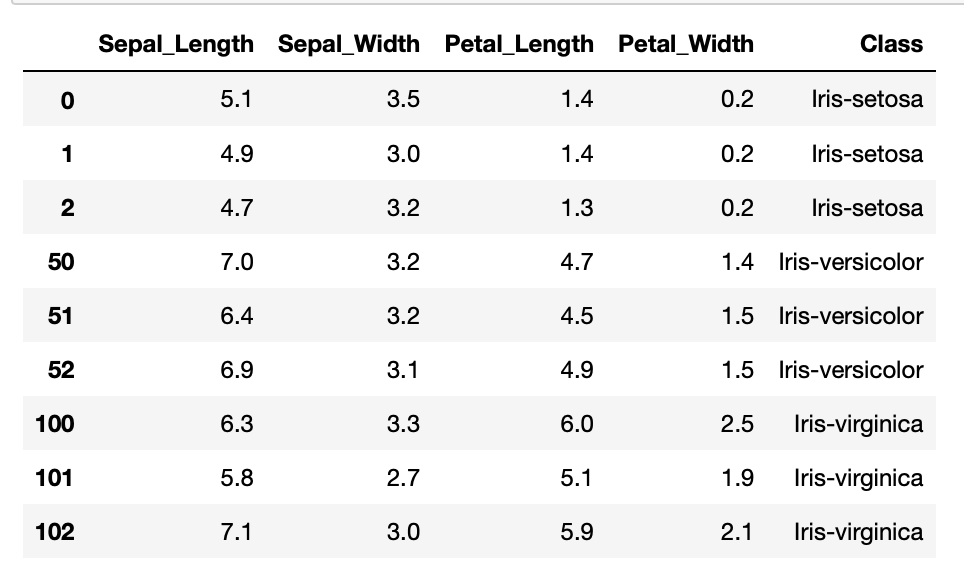

##### pands-project 
Project 2019 for Programming and Scripting Module


# Table of Contents

1. [Introduction to the project](#introduction) 
2. [Background information about the Iris data set](#background) 
3. [python libraries and other tools](#pythonlibraries)
4. [Download the Iris data set using python code](#loading)
5. [Exploring the data set -summary overview](#exploring)
6. [Exploring the data set in more detail](#detail)
6. [Summarise the data set](#summarise)
7. [conclusions](#conclusions)
10. [References](#references)


# 1. Introduction to the project. <a name="introduction"></a>

This repository contains my submission for the class project for the Programming and Scripting Module at GMIT as part of the Higher Diploma in Computing and Data Analytics.   
The pdf file containing the problem set instructions is available by clicking on the following link.  [Programming and Scripting Project 2019](https://github.com/ianmcloughlin/project-pands/raw/master/project.pdf)  

The project concerns the well-known Fisher's Iris data set. 
It entails researching the data set, and then writing documentation and code in the Python programming language based on that research.

- The first part of this document is the introduction to the project and contains the problem statement and requirements of the project.
- The second part outlines some background information about Fisher's Iris data set, including a little bit about Fisher whom the data set is named after. Why the data set was collected and how.
- The next part outlines the tools used in preparing and executing this project and what is required to run the code.
- The iris data set is loaded into python in the script.
- The Iris data set is then investigated using the python programming language. Using python to show a high level overview of the data describe it using some statistics. Explain the code used to produce these summary statistics.
- Show some basic plots that provide an overall picture of the Fisher Iris data set. 
-  look  more closely at the data with some more 
The next part of the analysis looks more closely at the species of iris plant when analysing the data set.  
Summary results are then provided.

## 
The purpose of the project is to investigate the Fisher Iris data set using python code. My main aim in the project is therefore to learn python programming by applying it to the iris data set. 
I intend to use the python documentation to do this and to build up my knowledge of python and its relevant packages as I go along.
A web search on the iris data set will return many pages. I will take a look at some of these. Many of these apply machine learning to the iris data set. I will have a little look at this and why the iris dataset is considered such an important database in the field of statistical and machine learning. There is much reference to the fact that one class is linearly separable from the other two classes so I will look at this in the code.


### Problem Statement <a name="problem-statement"></a>
The project should achieve the following goals:

1. Research background information about the data set and summarise it.    
2. Provide a list of references used in completing the project.  
3. Download the data set using Python code.
4. Investigate the data set using python code  
5. Summarise the data set using python. Provide summary statistics.  
5. Summarise the investigations.
6. Include supporting tables and graphics.

##### My project plan

I will use a Task List as described on the GitHub Flavoured Markdown Syntax cheatsheet. I will remove this for the submission once the tasks have been completed. The tasks should align with the goals and also the table of contents.

Project Task List

#### content tasks
- [x] Research Background information about the Iris data set and summarise it
- [x] List all the references used 
- [x] Download the Iris data set  
- [x] Investigate the Iris data set using python code
- [x] Summarise the Iris data set - provide statistics such as means, minimum and maximum values
- [ ] summarise the research a bit better so it not too long or irrelevant
- [ ] some information on Edgar Anderson and why he collected the data in the first place.
- [ ] a little bit on the linear disciminant function
- [ ] show how the linearly separable the data appears to be as noted in the research
- [ ] review the plots and highlight the important points
- [ ] more plots - looking at seaborn library at the moment. include the images
- [ ] consider the machine learning aspect of the iris data set
- [ ] Include examples of interesting analyses that others have pursued based on the data set.
- [ ] look at other python packages outside of pandas, matplotlib and seaborn such as scikit learn 
- [ ] Review comments in the python script and make sure they are clear
- [ ] look at the print output of the python script
- [ ] Note what I learned from the project, the knowledge and skills gained from completing it and how I went about it.
- [ ] Note how the code and the overall project achieves the goals of the project as per the plan
- [ ] look at how the code can be tested to do as you say it does and produce the correct outputs
- [ ] show the troubleshooting startegies and techniques used to solve problems and document it
- [ ] lessons I have learned from working on this project. Careful closing out of Jupyter notebooks!!
- [ ] 

#### organisation and presentation tasks
- [ ] review the layout of the readme
- [ ] maybe move all the plots out of the main python script as they slow down running the script
- [ ] table of contents. numbering
- [ ] keep the jupyter notebook in line with the python script and readme document.
- [x] get links to images working
- [ ] Ensure the project is well organised and contain detailed explanations throughout


## 2. Background information about the dataset 
<a name="loading"></a> 


Fisher's Iris data set is a famous database consisting of the measurements of parts of 150 iris flowers. It is available from the UCI Machine Learning Repository where it is listed as a multivariate data set with a default machine learning task of classification. The data set consists of 150 instances with 5 attributes. The data set was donated in 1988 by Michael Marshall but the data set was created by R.A. Fisher in 1936. 
http://archive.ics.uci.edu/ml/datasets/Iris.

[The UCI Machine Learning Repository](http://archive.ics.uci.edu/ml/about.html)
>The UCI Machine Learning Repository is a collection of databases, domain theories, and data generators that are used by the machine learning community for the empirical analysis of machine learning algorithms. 

The data set includes 50 plants each of three classes of iris plant, where each class is a different type or species of iris plant.
The three classes are Iris Setosa, Iris Versicolor and Iris Virginica. 
Four flower measurements are given for each observation in the data set, which are the lengths and widths of the petals and the sepals of the flowers in the sample. Each of the measurements is provided in centimetres.


 Iris Setosa,   Iris Versicolor and Iris Virginica
<p float="left">
  
  
   
</p>

See [iris_flower_description](iris flowers description.md) for more details.
The following attribute information is provided with the data set on the UCI Archive page.  
  
 Attribute Information:
   1. sepal length in cm
   2. sepal width in cm
   3. petal length in cm
   4. petal width in cm
   5. class: 
      - Iris Setosa  
      - Iris Versicolor  
      - Iris Virginica  

According to the [Iris Data Set Information](https://archive.ics.uci.edu/ml/datasets/iris) on the UCI Machine Learning Repository, Fisher's iris dataset is possibly the best known database to be found in the pattern recognition literature and it is still relevant today. One class is linearly separable from the other two classes, which are not linearly separable from each other. The predicted attribute of the data set is the class of iris plant to which each observation belongs. 

>This is perhaps the best known database to be found in the pattern recognition literature. Fisher's paper is a classic in the field and is referenced frequently to this day. 


#### (iris data set and machine learning)
The iris data set is a relatively small data set containing only 150 observations. Each observation in the data set represents one instance of an iris plant or flower. Each observation belongs to one class of three possible classes and this information is provided in the data set.  
It can be considered a multi-class classification problem as there are multiple classes in the data set and not just two. 

All the labels are provided in the data set. These labels are the species or class of iris plant that each observation belongs to. 
There are many machine learning algorithms which can be split into supervised or unsupervised learning.

Machine learning gives 'computers the ability to learn without being explicitly programmed' - definition attributed to Arthur Samuel.
Statistical learning is a set of tools for modelling and understanding complex data sets. Linear regression is used for predicting quantitative values such as house prices. Fisher developed linear discriminant analysis in 1936 to predict qualitative values such as which category or class of iris each observation belonged to.

##### Now a little bit about Fisher and the Iris data set. I will come back to this
##### Will also include a bit about Edgar Anderson, the American botanist who collected the data in the first place.
and why he did so. I think the reason Fisher and Anderson looked at the petal and sepal measurements as a way to classify the iris plants is relevant. From the description of the iris flowers, including features such as their overall height and leaf type as well as colour, it would seem that the different species could be easily separated. Yet they focused on only the petal and sepal lengths and widths, or more like a combination of the measurements.

Note that this information is primarily gathered from following the web links at the [Iris flower data set wikipedia wiki](https://en.wikipedia.org/wiki/Iris_flower_data_set#cite_note-5) and the [UCI Machine Learning Repository - Iris Data Set](https://archive.ics.uci.edu/ml/datasets/iris) pages which both provide references to the original works by R.A. Fisher and Edgar Anderson. The Iris flower data set or Fisher Iris data set is often called Anderson's Iris data set as the data was collected by Edgar Anderson.

[Ronald Fisher - wiki](https://en.wikipedia.org/wiki/Ronald_Fisher),
>Sir Ronald Aylmer Fisher FRS[3] (17 February 1890 – 29 July 1962) was a British statistician and geneticist. For his work in statistics, he has been described as "a genius who almost single-handedly created the foundations for modern statistical science"[4] and "the single most important figure in 20th century statistics".

Fisher also developed the ANOVA method (Analysis of Variance) which he used to analyse data from crop experiments. He pioneered the principles of the design of experiments and the statistics of small samples and the analysis of real data.

In 1936 Fisher introduced the Iris flower data set as an example of discriminant analysis. 
The two species Iris Setosa and Iris Versicolor were found growing together in the same colony in the Gaspé Pensinsula in Canada. The sample of the third species - the Iris Virginica differs from the other two samples as they were not taken from the same natural colony. 
[Edgar Anderson](include_link)
While Fisher used the iris data set as an example of statistical methods of classification, the iris data itself was actually collected by Edgar Anderson, an american botanist and geneticist. Anderson was interested in the variation in plant species and in evolution in general. He had observed in his work that there was a lot of genetic variation within most populations of plants. He was interested in species and the variation within a species or a group of species. He set out to find a few easily recognisable, well-differentiated species.
Anderson chose the Iris Versicolor (also known as the northern blue flags) because they were a 'comparatively simple, stable and well marked group. 
#### provide the reference to this and a bit more information on this point.
Iris versicolor and iris virginica were chosen as they usually grow in colonies containing many individual plants

According to Fisher's paper, [The Use of Multiple Measurements in Taxonomic Problems by R.A Fisher](https://onlinelibrary.wiley.com/doi/pdf/10.1111/j.1469-1809.1936.tb02137.x):
>When two or more populations have been measured in several characters, xl, ...,x8, special interest attaches to certain linear functions of the measurements by which the populations are best discriminated.

Fisher considered the question of what linear function of the four measurements would maximise the ratio of the difference  between the specific means to the standard deviation between species.
Based on the combination of the four measurement features of the sample of plants in the iris datas set, Fisher developed a linear discriminant model to discriminate or distinguish the iris species from each other. 

Linear disciminant analysis is a popular classification technique for classification where there are multiple classes. 

[Linear Disciminant Analysis](https://en.wikipedia.org/wiki/Linear_discriminant_analysis)
>Linear discriminant analysis (LDA), normal discriminant analysis (NDA), or discriminant function analysis is a generalization of Fisher's linear discriminant, a method used in statistics, pattern recognition and machine learning to find a linear combination of features that characterizes or separates two or more classes of objects or events. The resulting combination may be used as a linear classifier, or, more commonly, for dimensionality reduction before later classification.

>Based on Fisher's linear discriminant model, this data set became a typical test case for many statistical classification techniques in machine learning such as support vector machines. [Use of the Iris Data Set](https://en.wikipedia.org/wiki/Iris_flower_data_set).

The Fisher Iris data set is still widely used in learning classification methods.

## Python and other software used in this project

### How to run the python code

The purpose of this project is to investigate the Fisher Iris data set described above using python code.
Python is a high level interpreted general purpose programming language. The python interpreter and its extensive standard library are freely available to all. Along with the python standard library, there are many libraries that enhance the usage of python and make it a powerful tool for performing data analytics and machine learning.
Make sure you have Python 3 installed. If not go to https://www.python.org/downloads/ and follow the instructions.

To run the python script, first navigate to the folder downloaded from this repository.

At the command line enter python <program_name> for example: $ python project_iris.py

The python program can also be run inside the environment of an iPython session using the `%run` command.
 `% run project_iris.py`

### Loading python libraries

The `pandas` library is the main python library being used in this project. According to the [pandas package overview ](https://pandas.pydata.org/pandas-docs/stable/getting_started/overview.html)  

> `pandas` is a `Python` package providing fast, flexible, and expressive data structures designed to make working with “relational” or “labeled” data both easy and intuitive. It aims to be the fundamental high-level building block for doing practical, real world data analysis in Python. 

According to [pandas.pydata.org](https://pandas.pydata.org/index.html),`pandas` provides high-performance, easy-to-use data structures and data analysis tools for the Python programming language. `pandas` is designed for working with data that is in a tabular format containing an ordered collection of columns where each column can have a different value type.  This makes it ideal for exploring a structured tabular dataset such as Iris which contains several numerical columns and one categorical column. 

In addition to `pandas`, the `seaborn` library is also used for plotting which requires `matplotlib.pyplot` for some functions.

[seaborn.pydata.org](https://seaborn.pydata.org/index.html)
>Seaborn is a Python data visualization library based on matplotlib. It provides a high-level interface for drawing attractive and informative statistical graphics. 

[matplotlib.org](https://matplotlib.org)
>Matplotlib is a Python 2D plotting library which produces publication quality figures in a variety of hardcopy formats and interactive environments across platforms

The libraries must first be imported before they can be used by the script as they are not part of the Python standard library. 
I do this at the very beginning of the script. 

The pandas library is imported at the very start of the script using `import pandas as pd`. Therefore wherever `pd` is used in the script, it is referring to the pandas library. Similarly, the `seaborn` library is imported as `sn` and thereafter referred to using `sn`. These are the names that are used by convention. Once these packages are loaded, all of the available functions can be used by the script.

```python
import pandas as pd  
import matplotlib.pyplot as plt 
import seaborn as sns
```

Help can be obtained using the python help function
For example `help(pd)` or `help(pd.DataFrame.describe)`

### Getting help in python
To get help on any python command, I can use the python help function as outlined in the [Python help command document](https://docs.python.org/3/library/pdb.html?highlight=help#pdbcommand-help) with the command in parentheses.  
For example, `help(pd)` will show help on the python `pandas` package while `help(pd.DataFrame.describe())` provides help on the `describe` function of the pandas DataFrame.    
The documentation pages for each of the python packages that are used in this project provided details of all the commands for that package. I found these resources quite valuable for this project and referred to them extensively over the course of this project, when looking for a function to do something in particular but also for getting a start with the packages as the documentation pages seem to list everything that the packages can do.

 
-[Pandas.pydata documentation](https://pandas.pydata.org/pandas-docs/stable/getting_started/index.html)  
-[Matplotlib documentation](https://matplotlib.org/index.html)  
-[Seaborn.pydata documentation](https://seaborn.pydata.org/index.html)  
-[Python 3 documentation](https://docs.python.org/3/index.html)  

### GitHub and Git

## 3. Download the dataset and investigate it using Python code
<a name="loading"></a>

The Iris Data Set is available from the UC Irvine Machine Learning Repository at http://archive.ics.uci.edu/ml/datasets/Iris in csv format as described above in section 2. 
I am using the python `pandas` library to import the csv file.`pandas` is designed for working with data that is in a tabular format containing an ordered collection of columns. Each column can have a different value type which makes it suitable for exploring a structured tabular dataset such as Iris which contains several numerical columns for the measurements and one categorical column for the class. 

Using `pandas`, tabular data can be imported as a `DataFrame` object. A pandas `DataFrame` represents a rectangular table of data containing an ordered collection of columns and each column can have a different value type. 

The pandas `read_csv`function loads delimited data from a file, URL or file-like object using the comma as the default delimiter and  creates a `DataFrame` object. When a pandas `DataFrame`  object is created, it has many attributes and methods available that can be used on that object.

The Iris data set can be read in directly from the url at [https://archive.ics.uci.edu/ml/machine-learning-databases/iris/iris.data] (https://archive.ics.uci.edu/ml/machine-learning-databases/iris/iris.data)or alternatively it can be saved locally and read in by specifiying the file path.   
In the script, I will download the csv file into python as part of the script. The csv file containing the Iris data set is also saved into this project's repository for convenience. 

The raw csv file at the UCI Machine Learning repository does not have the attribute information included in the csv file itself. However this information can be found under the section [Iris Data Set: Attribute Information](https://archive.ics.uci.edu/ml/machine-learning-databases/iris/iris.names) and provides the attribute information consisting of the 4 measurement attributes (sepal length in cm, sepal width in cm, petal length in cm, petal width in cm) and the three classes (Iris Setosa, Iris Versicolor and Iris Virginica).   
 `read_csv` has various options for specifying what column names to use. [pandas-csv-text-files](https://pandas.pydata.org/pandas-docs/stable/user_guide/io.html#csv-text-files). Often the first row of a csv file would contain the column names. If column names are not passed to `read_csv`, by default it looks to the first row of the data and infers the row names from this row. You could specify the row number to use as column names. In the script I use the `names` argument to specify the names to use as column names.  

The data types for each column will be inferred by the `read_csv` function if not explicitly provided to `read_csv`. 
`index` (row labels) and `columns` (column labels) could be provided as optional arguments to `read_csv`, otherwise they will be constructed from the input data. 
The raw csv file does not contain any headers. Column names can be added to the DataFrame.   

My code for reading in the Iris data set does the following:

1. Create `csv_url` and pass to it the url where the data set is available 'https://archive.ics.uci.edu/ml/machine-learning-databases/iris/iris.data'. 
2. Create a list of column names `col_names` using the iris attribute information. 
3. Create a panda's DataFrame object called `iris`.
There are other parameters which can be set for the `read_csv` function and these can be found using `?pd.read_csv`. 

```python
      csv_url = 'https://archive.ics.uci.edu/ml/machine-learning-databases/iris/iris.data'
      # using the attribute information as the column names
      col_names = ['Sepal_Length','Sepal_Width','Petal_Length','Petal_Width','Class']
      iris =  pd.read_csv(csv_url, names = col_names)
```

Having loaded the iris data set, the resulting `iris` DataFrame can be viewed using the DataFrame methods `head()` and `tail()` to see the first 5 rows and the last 5 rows respectively. The data types can be checked to ensure they were correctly inferred using `dtypes`.
Use the `print` function with these to print the results to the screen.

```python
print(iris.head())
print(iris.tail())
print(iris.dtypes)
```


## Exploring the dataset - summary results

The first part of my analysis looks at an overview of the Fisher Iris data set including some summary statistics that describe the data at a high level and some basic plots that provide an overall picture of the Fisher Iris data set. 

As mentioned above, Fishers Iris data set is well known in the pattern recognition field because one class of the three iris plants in the data set are linearly separable from the other two classes. The other two classes are not linearly separable from each other.

Therefore, having looked at the data set as a whole, I will look more closely at the data at the iris species / class level and see are there clear differences visible in the data.

(As this project is more about learning python programming than learning machine learning, I will see if these differences are obvious using some python code.)

The `pandas` library has many functions that can be used to explore the Iris data set. Having imported the iris data set from a csv file into a pandas `DataFrame`, all the attributes and methods of `DataFrame` objects can be used on the iris DataFrame object.

### Summary results of the Fisher Iris data set. 

##### Attributes of the iris DataFrame 
I looked at the attributes of the `iris` DataFrame in the section # EXPLORING & INVESTIGATING THE IRIS DATA SET of the project_iris.py python script.   

In summary:  
- The iris DataFrame has two dimensions.   (`ndim`)
- It consists of 150 rows and 5 columns corresponding to the 150 rows of observations in the csv data and the five columns of data.(`shape`) 
- The columns on the dataset contain the column names that were specified when reading in the csv file. (`columns`)
'Sepal_Length', 'Sepal_Width', 'Petal_Length', 'Petal_Width','Species'. (If the csv data set had contained a row of column names at the top of the file, then this could have been used to set the column names.)  
- There are 750 elements in total in the iris dataframe.  (`size`)
- The dataframe is assigned a range index by default on reading in the data set. This index starts at 0 for the first row of observations and goes up to 149 for the last row of observations. The index can be changed if desired.   (`index`)
- The datatypes of the numeric measurement columns are floats.   (`dtypes`)

##### Using `DataFrame` methods to explore the iris data set.

Table 1 from Fisher's paper `The Use of Multiple Measurements in Taxonomic Problems` shows the four measurement for each of the three Iris Species. 
- Sepal length
- Sepal width
- Petal length
- Petal Width  
  

The equivalent data is shown in the iris DataFrame resulting from reading in the csv file, although the layout is slightly different.
The `head` and `tail` methods are useful to take a quick look at the observations at the top and bottom rows of the dataframe. The number of rows to display can be specified as an argument. The rows at the top belong to the setosa class. The rows at the bottom belong to the virginica class. This is just the way the observations are ordered in the csv data set. 

##### The top of the iris data set:


##### The bottom of the iris data set:


- `pandas` objects have a set of common mathematical and statistical methods. Most of these methods produce a single value such as the mean or the max or standard deviation.  Multiple summary statistics can be obtained in one go using pandas.descibe().

- Using the `describe` method to produce some quick summary statistics produces the following table. These statistics are for the data set as a whole. (Later I look at the descriptive statistics by class or species of iris plant).

The pandas `describe` function shows the count number of the non-NA/null observations in the dataset. There are 50 observations in each class. The `max` shows the maximum of the values and the `min` shows the minimum of the values. 
The `mean` shows the mean or average  of the values (the sum of data values divided by total number of values), the `std` shows the standard deviation (a measure of the dispersion or spread of the data) of the observations. The `describe` function also shows the 25th, 50th and 75th percentiles. The 25th percentile shows the percentage of values falling below that percentile. The 50th percentile shows the same information as the median would, that is where 50% of the values fall above and 50% fall below the value.

- The various statistics that are generated from the `describe` function can also be obtained on their own. For example the mean could be obtained using `iris.mean()`, minimum with `.min()` etc.


- The initial exploration of the Iris DataFrame shows that there are 150 rows and 5 columns of data. 
Each row corresponds to an individual observation of an iris plant. 
- The columns show the individual measurements (in centimetres) of the length of the sepal, the length of the petal, the width of the sepal and the width of the petal.

- The mean of the Sepal length is greater than the mean of the other three measurements.   
- The measurements of the petal width has the lowest average measurements.   
- The standard deviation in the petal lengths shows the highest variability of the four measurements at 1.76 while the standard deviations of the petal width is approx 0.43.  

- The shortest petal in the data set is 1 cm while the longest petal is 6.9 cm.  
- The widths of the petals vary from 0.1 cm to 2.5 cm.  
- The shortest sepal in the data set is 4.3 cm while the longest sepal is 7.9 cm. The narrowest sepal is 2cm while the widest sepal is 4.4 centimetres.  


The data can be checked for any missing values. By default, the descriptive statistics on `pandas` objects exclude missing value.  
The Fisher Iris data set is a small data set and it does not have any missing values.
`pandas.isnull` can be used to check for missing data. It returns a True or False boolean value for each observation. Boolean values are coerced to a 1 for True and 0 for False so the `sum` function can be used to count the number of `True` values in the data set, rather than printing all the `True` and `False` values.
`notnull()` returns the opposite of `isnull` while `notna` is the opposite of `isna`.

A `histogram`is a representation of the distribution of data. It charts the data using rectangular bars that are adjacent to each other and display either the frequency or relative frequency of the measurements on the interval or ratio scale.
 The pandas `hist` function calls `matplotlib.pyplot.hist` on each numerical series in the DataFrame, resulting in one histogram per column.

The histograms here show the distribution of each of the the measurements attributes across the iris data set. 


The histogram for the petal lengths show a clear group of observations having petal lengths that are much smaller than the rest of the observations. Similarly with the petal widths. The sepal lengths show quite a bit of variation with a number of peaks while sepal widths seem to be centred around 3 cms but with a few smaller peaks at both sides of 3 cms.  
  
Looking at a basic boxplot of the iris dataset:


Interpreting the boxplot. the boxplot is a useful plot as it show various statistics in one go, including the median, quantiles, interquartile range, outliers etc.
The length of the box is the interquartile range and measures the variability in the data set. The interquartile range (IQR) is the middle 50% of the data and can show the spread or variation of the data. The whiskers show if the data is skewed on one direction or the other. The median is the line through the box. (horizontal line in the plot above)
There are three classes or species of iris flower in this data set, the Iris Setosa, the Iris Versicolor and the Iris Virginica.
It is possible to look at the summary statistics as the class or species level.

### also include some of the scatter plots here. 

A scatter plot is a useful plot that visually shows how the different variables or features in the data set correlate with one another. 

Having looked at the basic statistical properties of the iris data set and having pictured the data gives a better understanding of the data and what can be done with it. The iris data set is widely used for demonstrating machine learning so I will look a little bit at this. As mentioned earlier, one class is linearly separable from the other two classes. A linearly separable data set is one where the observations or data points can be separated by a straight line drawn through the data.
I will look at the pairwise scatter plots for this as this concept of linear separation is more applicable to data with two classes. The iris data set is a multi-class data set as there are three classes to which the observations could belong to.

Can see on the scatter plots that the setosa is clearly separable from the other two species when the sepal lengths are plotted against the sepal width. However it is not so simple to separate to separate the other two classes.
When the petal lengths are plotted against the petal widths, again the setosas are clearly identifiable. now it lookes a nit easier to separate the other two classes.

### insert bit about machine learning here.


### Summary results of the Fisher Iris data set by species or class or iris plant.
As mentioned earlier, Fisher's iris dataset is a well known data set in pattern recognition literature. One class / species of the three iris classes is linearly separable from the other two classes, which are not linearly separable from each other. 
Therefore I will now look at the different classes on their own. To do so, I will need to be able to separate the observations into three groups based on their known class. 

There are several ways of selecting data from the DataFrame that is detailed on the pandas documentation [Indexing and selecting data](http://pandas.pydata.org/pandas-docs/stable/user_guide/indexing.html#indexing-and-selecting-data).

Indexing with square brackets will return a `Series` corresponding to the column name. A column of data can be retrieved from the Iris DataFrame using dict-like notation or by attribute such as `iris.Petal_Width`. The rows of the iris DataFrame can be retrieved by position name or by using the `loc` attribute.  
The index operators can be used to select a subset or rows and columns using the `loc` attribute for axis labels or `iloc` attribute for integers.  The index for the iris DataFrame is a range of integers from 0 to 150. An index into the dataframe can used to retrieve one or more columns, either with a single value or a sequence of values for the index.

[Boolean Indexing](http://pandas.pydata.org/pandas-docs/stable/user_guide/indexing.html#boolean-index) could be used to select rows from the `iris` DataFrame by filtering the data for rows that correspond to a a particular class or species of the iris plant.  

```python
      # select from the iris DataFrame only the rows where the Class equals the string "Iris-setosa"
      iris_setosa = iris[iris['Class'] == "Iris-setosa"]
      iris_setosa.head()
```


I could create subsets of the iris DataFrame for each class or species of Iris plant by using one of these methods.  
There is another way, using the pandas `groupby` function that I will use to split the iris data set into subset groups by their class or species of iris plant.
The `groupby` function can be used to group the data by a `Series` of columns. A `groupby` operation involves some combination of splitting the data into groups of observations based on some criteria and then applying a function to each group independently. 
I can then look at the characteristics and statistics of each subset group.

`GroupBy` objects are returned by `groupby` calls. Descriptive statistics and computations can be applied to these `GroupBy` objects.


##### The first 3 rows of each Class in the iris data set:


##### The last 3 rows of each Class in the iris data set:


The statistics at the class level show that the average petal length for a Setosa is much smaller at 1.464 cm than the other two classes. The average petal length for the Versicolor is 4.26 while the iris Virginica has the largest average petal length of 5.552 centimetres which is almost four times greater than the petal length of the Iris Setosa.
The standard deviation of the setosa petal length is quite small compared to the standard deviation of the other two species. The petal measurements of the iris setosa is much less variable than that of the other two species. 

The average petal width of the setosa is also much smaller than the average petal width of the other two species. In fact the petal width of the setosa is twelve times smaller than the petal width of the virginica. There is less variability in petal widths in all three species though compared to the variability in the petal length.
There is not such a large difference between the sepal lengths of the three iris species, although the setosa is again showing the smallest average measurements.
The average sepal width of the setosa however is actually larger than the averages for the other two species. The average sepal width for the setosa is 3.42 centimetres compared to an average of 2.77 cm for the Versicolor and 2.97 for the virginica. This is also shown in the minimum and maximum measurements for the three species.

From the summary statistics of the sepal and petal measurements by class type it would seem that the iris setosa is very different from the other two species, the versicolor and the virginica.

##### The summary statistics for each Class of iris plant in the data set:


Table II in Fisher's paper is entitled *Observed means for two species and their difference (cm.)*
This table displays the means for each of the 4 measurements for the Iris-Versicolor and Iris-Setosa species. It also shows the differences between the Versicolor means and the Setosa means for each of the 4 measurement variables.

##### The difference in means between iris species:


### Correlation between variables.
Correlation is a statistical method used to determine whether a linear relationship between variables exists. It shows if one variable tends to occur with large or small values of another variable. It calculates a number *r* between -1 and + 1 where the number (the correlation coefficient) indicates the strength of the relationship and the sign indicates whether that relationship is positive or negative. The correlation coefficient does not depend on the units of measurement or on which variable is on the x or y axis. 
(In the case of the Iris data set, the measurements are all in the same units anyway as they are provided in centimetres.)
The correlation statistics are computed from  pairs of arguments.
The correlation of the measurements can be got using the `corr` method on the DataFrame. If there is a strong positive relationship beytween the variables, the value of the correlation coefficient *r* will be close to 1, while a strong negative relationship will have a correlation coefficient *r* close to -1. A vlaue of *r* close to zero would indicate that there is no relationship between the variables.

A scatter plot is used to visualise the relationship between two variables. It is a graph of the ordered pairs of two variables. One variable is plotted on the x-axis while the other variable is plotted on the y-axis.

##### The correlation coefficients between measurement variables:


### Visualising the Iris data set by class of iris.

The `matplotlib` package can be used to create a graph or plot of the Iris Data set. The `pandas` library also has some built in methods to create visualisations from DataFrame and Series objects which are based on the `matplotlib` library.
The `seaborn` library is used for making statistical graphics in Python. It is built on top of matplotlib and closely integrated with pandas data structures. It provides a high-level interface for creating nice looking and informative plots. 
It's dataset-oriented plotting functions operate on DataFrames such as the `iris` dataframe created from importing the csv data.
[pandas-visualisation](https://pandas.pydata.org/pandas-docs/stable/user_guide/visualization.html#visualization)  
[matplotlib -pyplot](https://matplotlib.org/tutorials/introductory/pyplot.html#sphx-glr-tutorials-introductory-pyplot-py)
[seaborn](https://seaborn.pydata.org/introduction.html#introduction)
I will use `seaborn` to create a facetted scatter plot. The iris measurement variables determine the position of each point on the axes. 
- A `scatter plot` can be used to visualize relationships between numerical variables such as the petal measurements and the sepal measurements in the iris data set.    
- A `catplot()` can capture the relationship between a numeric variable and one (or more) categorical variables, such as the class or species of iris plant.   

The `seaborn` documentation section called [Visualising dataset structure](http://seaborn.pydata.org/introduction.html#visualizing-dataset-structure) actually illustrates some of the `seaborn` plotting functions using the iris data set which is built into the seabron library.

It's `jointplot()` function focusses on a single relationship in the data set, while it's `pairplot()` function shows all pairwise relationships and the marginal distributions that can be conditioned on a categorical variable.

The function `relplot()` is used to visualize many different statistical relationships.


##### The scatter plots between measurement variables:


The `DataFrame` method `duplicated` can be used to see if any of the rows in the data set are duplicates of another row. I am just using it to see if there are any individual observations that have the exact same measurements as another observation.

There are three observations which appear to have the same measurements as other observations in the dataset as follows. It is possible that these values may have been rounded at some stage when or since the dataset was put together in 1936.

index
34   Iris-setosa
37   Iris-setosa
142  Iris-virginica

## some machine learning.
Machine learning is about learning from data. It is often associated with artificial intelligence but it is also used in  areas such as image and voice recognition, natural language processing and many other areas. Machine learning uses some algorithm to solve the problems. An algorithm takes an inputs and produces some outputs. An algorithm applied to the Iris data set might take in the features of some observations and output the class to which the observation is more likely  to belong to. Some classification algorithms are based on nearest neighbour, where an observation might be assigned to a class based on its proximity to another observation.

The iris data set consists of 4 fields or variables. Each of the rows is called an observation or a data point. The aim of a machine learning or classification algorithm would be to predict the class label of the observation, i.e. which species of iris plant the observation belongs to. Each observation in the iris data set consists of a 4 dimensional array of numerical measurement data.

The iris dataset appears in many text books and tutorials related to statistical and machine learning. The machine learning task that is generally applied to the iris data set is classification. (as per the UCI Archive page). The objective of classification would be to classify a new flower (from outside the data set) to the correct class or species to which it belongs. 

At a quick first glance, the iris flowers would seem quite similar. Why not use colour or other features of the plants to categorise as a way to predict the class? 
We are essentially using the domain knowledge of the experts in the field - the biologists or botanists who determined this in the first place - Anderson and Fisher. 
Some domain knowledge is important in machine learning. There must be some way to make sense of the data and to give it some context.


## 10. References
<a name="references"></a>

- [Python Data Analysis Library](https://pandas.pydata.org)

- [10 Minutes to Pandas](https://pandas.pydata.org/pandas-docs/stable/getting_started/10min.html)

- [Mastering Markdown](https://guides.github.com/features/mastering-markdown/)

- [Github Flavoured Markdown](https://github.github.com/gfm/#what-is-github-flavored-markdown-)

- [UCI Machine Learning Repository: Iris Dataset](https://archive.ics.uci.edu/ml/datasets/iris)

- [Python, R and Linux Tips](https://cmdlinetips.com/category/python/)

- [Wikipedia - Iris Flower Data Set](https://en.wikipedia.org/wiki/Iris_flower_data_set)

- [Wikipedia - Ronald Fisher](https://en.wikipedia.org/wiki/Ronald_Fisher)

- [cmdlinetips.com](https://cmdlinetips.com/2018/01/7-tips-to-read-a-csv-file-as-pandas-data-frame/)

- [Iris Dataset - Exploratory Data Analysis](https://www.kaggle.com/lalitharajesh/iris-dataset-exploratory-data-analysis)

- [seaborn:statistical data visualisation ](https://seaborn.pydata.org/index.html)

- [Multiple Measurements in Taxonomic Problems by R.A Fisher](https://onlinelibrary.wiley.com/doi/pdf/10.1111j.1469-1809.1936.tb02137.x)

- Python for Data Analysis - Wes McKinney
Data Wrangling with Pandas, NumPy and IPython

For this project, I am mainly working through the python documentation as follows 
- [Python 3 documentation](https://docs.python.org/3/index.html)    
- [Pandas.pydata documentation](https://pandas.pydata.org/pandas-docs/stable/getting_started/index.html)    
- [Matplotlib documentation](https://matplotlib.org/index.html)    
- [Seaborn.pydata documentaion](https://seaborn.pydata.org/index.html)    

I hope to explore some of the other python libraries.
I am also reading through the `Python for Data Analysis` book by Wes McKinney, who is the creator of the Python Pandas project.
