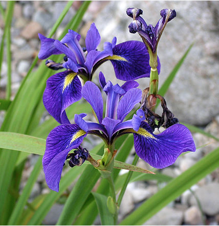
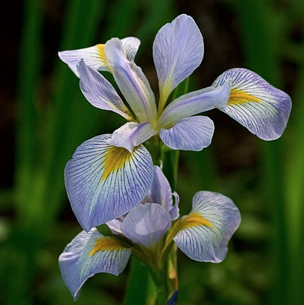

# IRIS FLOWERS DESCRIPTION

# side by side images using paragraph tags. using height=200
 Iris Setosa,   Iris Versicolor and Iris Virginica

  
  
   

#### The iris setosa
See [Iris setosa description](https://en.wikipedia.org/w/index.php?title=Iris_setosa&oldid=858265829).

- The Iris setosa has *mid-green* leaves, which are *grass-like*, and lanceolate (sword-shaped).   
- They have a *purplish tinged base* and the leaves can measure *30–60 cm long by 0.8–2.5 cm wide*.  
- The plant has 3–4 flowers per stem (between 6 and 13 for the whole plant,in groups of 3, and it blooms between June and July.
- The large flowers are between 5–8 cm across,usually 7–8 cm, and come in a range of shades of blue, which can depend on the location. and range from violet, purple-blue, violet-blue, blue,to lavender. Very occasionally, there are pink or white forms.
- Like other irises, it has 2 pairs of petals, 3 large sepals (outer petals), known as the 'falls' and 3 inner, smaller petals (or tepals), known as the 'standards'. 
- The sepals can be deeply veined dark purple with a yellow-white signal (centre). 
- The standards are so small, that they are reduced to bristles.Which gives the flower, a flat, three petal appearance

### The Iris versicolor 
see [iris versicolor description](https://en.wikipedia.org/wiki/Iris_versicolor)

- The *Iris versicolor* is a species of Iris native to North America, in the Eastern United States and Eastern Canada
- Iris versicolor is a flowering herbaceous perennial plant, growing 10–80 cm high. 
- It tends to form large clumps from thick, creeping rhizomes. 
- The unwinged, erect stems generally have basal leaves that are more than 1 cm wide. 
- Leaves are folded on the midribs so that they form an overlapping flat fan. 
- The well developed blue flower has 6 petals and sepals spread out nearly flat and have two forms. 
- The longer sepals are hairless and have a greenish-yellow blotch at their base. The inferior ovary is bluntly angled. 
- Flowers are usually light to deep blue (purple and violet are not uncommon)

### The Iris Virginica
see [iris virginica description](https://en.wikipedia.org/wiki/Iris_virginica)
The plant has 2 to 4 *erect* or arching, *bright green, lance-shaped* leaves that are flattened into one plane at the base. 
- Leaves are *1–3 cm* wide and are sometimes longer than the flower stalk. 
- The slightly fragrant flowers (4 cm long, 7 cm across) consist of 3 horizontal sepals, or "falls", and 3 erect petals. 
- The petals and sepals can vary in color from dark-violet to pinkish-white. 
- The sepals have a splash of yellow to yellow-orange at the crest. 
- Each plant has 2 to 6 flowers that bloom from April to May upon a single, erect, 30–90 cm tall stalk. 
- The stalk is sometimes branched and has a slight zigzag appearance.

[side by side images in a GitHub readme.md](https://stackoverflow.com/questions/24319505/how-can-one-display-images-side-by-side-in-a-github-readme-md)

Iris Setosa | Iris Versicolor | Iris Virginica
------------ | -------------   ----------------
tall branching stems | large clumps | 10 -80 cm height
mid-green leaves | basal leaves | leaves 1-3 cm wide, erect bright green leaves
violet  | light to deep blue | 
 3-4 flowers per stem | 6 petals and sepals | 
 flowers 5-8 cm across |                |

### The iris setosa
See [Iris setosa description](https://en.wikipedia.org/w/index.php?title=Iris_setosa&oldid=858265829).
- The *Iris setosa* is a species in the genus Iris. 
- It is a rhizomatous perennial from a wide range across the Arctic sea, including Alaska, Maine, Canada, Russia, northeastern Asia, China, Korea and southwards to Japan.
- The plant has **tall branching stems, mid green leaves and violet, purple-blue, violet-blue, blue, to lavender flowers.** There are also plants with pink and white flowers.

#### Leaves of the iris setosa
- The Iris setosa has mid-green leaves, which are grass-like, and lanceolate (sword-shaped). 
- They have a purplish tinged base and the leaves can measure 30–60 cm long by 0.8–2.5 cm wide.

#### Flowers of the iris setosa
- The plant has 3–4 flowers per stem (between 6 and 13 for the whole plant,in groups of 3, and it blooms between June and July.
- The large flowers are between 5–8 cm across,usually 7–8 cm, and come in a range of shades of blue, which can depend on the location. and range from violet, purple-blue, violet-blue, blue,to lavender. Very occasionally, there are pink or white forms.
- Like other irises, it has 2 pairs of petals, 3 large sepals (outer petals), known as the 'falls' and 3 inner, smaller petals (or tepals), known as the 'standards'. 
- The sepals can be deeply veined dark purple with a yellow-white signal (centre). 
- The standards are so small, that they are reduced to bristles.Which gives the flower, a flat, three petal appearance

### The Iris versicolor 
see [iris versicolor description](https://en.wikipedia.org/wiki/Iris_versicolor)

- The *Iris versicolor* is a species of Iris native to North America, in the Eastern United States and Eastern Canada
- Iris versicolor is a flowering herbaceous perennial plant, growing 10–80 cm high. 
- It tends to form large clumps from thick, creeping rhizomes. 

#### Iris Versicolor leaves
- The unwinged, erect stems generally have basal leaves that are more than 1 cm wide. 
- Leaves are folded on the midribs so that they form an overlapping flat fan. 

#### Iris versicolor flowers
- The well developed blue flower has 6 petals and sepals spread out nearly flat and have two forms. 
- The longer sepals are hairless and have a greenish-yellow blotch at their base. The inferior ovary is bluntly angled. 
- Flowers are usually light to deep blue (purple and violet are not uncommon)

### Iris Virginica

- The *Iris virginica*, with the common name Virginia iris, is a perennial species of flowering plant, native to eastern North America.
- It is common along the coastal plain from Florida to Georgia in the Southeastern United States

#### Iris Virginica leaves
- The plant has 2 to 4 erect or arching, bright green, lance-shaped leaves that are flattened into one plane at the base. 
- Leaves are 1–3 cm wide and are sometimes longer than the flower stalk. 
- The fleshy roots (1–2 cm in diameter) are rhizomes that spread underground. 
- Pale brown, variably shaped seeds are born in three-part fruit capsules (3–6 cm long, 1–2 cm  wide).

#### Iris Virginica Flowers
- The slightly fragrant flowers (4 cm long, 7 cm across) consist of 3 horizontal sepals, or "falls", and 3 erect petals. 
- The petals and sepals can vary in color from dark-violet to pinkish-white. 
- The sepals have a splash of yellow to yellow-orange at the crest. 
- Each plant has 2 to 6 flowers that bloom from April to May upon a single, erect, 30–90 cm tall stalk. 
- The stalk is sometimes branched and has a slight zigzag appearance.

## LEAVES 

### SETOSA
The Iris setosa has *mid-green* leaves, which are *grass-like*, and lanceolate (sword-shaped). 
They have a *purplish tinged base* and the leaves can measure *30–60 cm long by 0.8–2.5 cm wide*.

### VERSICOLOR

The unwinged, erect stems generally have *basal leaves* that are more than *1 cm wide*. 
Leaves are *folded on the midribs* so that they form an overlapping flat fan. 

### VIRGINICA
The plant has 2 to 4 *erect* or arching, *bright green, lance-shaped* leaves that are flattened into one plane at the base. 
- Leaves are *1–3 cm* wide and are sometimes longer than the flower stalk. 

## FLOWERS

### SETOSA

3–4 flowers per stem, Between 6 and 13 for the whole plant,in groups of 3
The large flowers are between 5–8 cm across,usually 7–8 cm, and come in a range of shades of blue, and range from violet, purple-blue, violet-blue, blue,to lavender. Very occasionally, there are pink or white forms.
Like other irises, it has 2 pairs of petals, 3 large sepals (outer petals), known as the 'falls' and 3 inner, smaller petals (or tepals), known as the 'standards'. 
The sepals can be deeply veined dark purple with a yellow-white signal (centre). 
The standards are so small, that they are reduced to bristles.Which gives the flower, a flat, three petal appearance

#### Iris Virginica Flowers
- The slightly fragrant flowers (4 cm long, 7 cm across) consist of 3 horizontal sepals, or "falls", and 3 erect petals. 
- The petals and sepals can vary in color from dark-violet to pinkish-white. 
- The sepals have a splash of yellow to yellow-orange at the crest. 
- Each plant has 2 to 6 flowers that bloom from April to May upon a single, erect, 30–90 cm tall stalk. 
- The stalk is sometimes branched and has a slight zigzag appearance.

### The Iris versicolor 
see [iris versicolor description](https://en.wikipedia.org/wiki/Iris_versicolor)

- The *Iris versicolor* is a species of Iris native to North America, in the Eastern United States and Eastern Canada
- Iris versicolor is a flowering herbaceous perennial plant, growing 10–80 cm high. 
- It tends to form large clumps from thick, creeping rhizomes. 

#### Iris Versicolor leaves
- The unwinged, erect stems generally have basal leaves that are more than 1 cm wide. 
- Leaves are folded on the midribs so that they form an overlapping flat fan. 

#### Iris versicolor flowers
- The well developed blue flower has 6 petals and sepals spread out nearly flat and have two forms. 
- The longer sepals are hairless and have a greenish-yellow blotch at their base. The inferior ovary is bluntly angled. 
- Flowers are usually light to deep blue (purple and violet are not uncommon)

